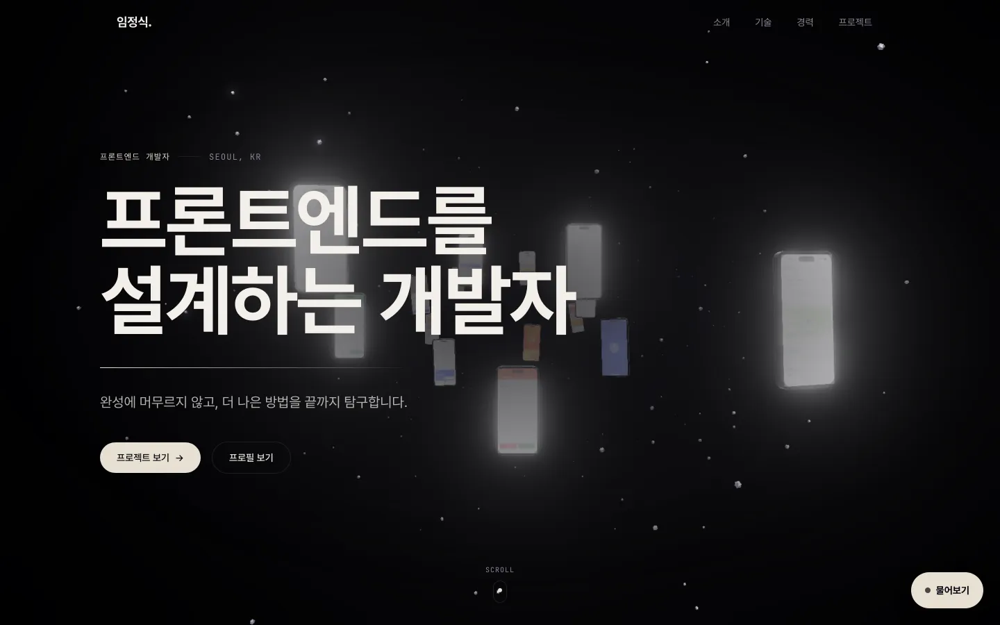
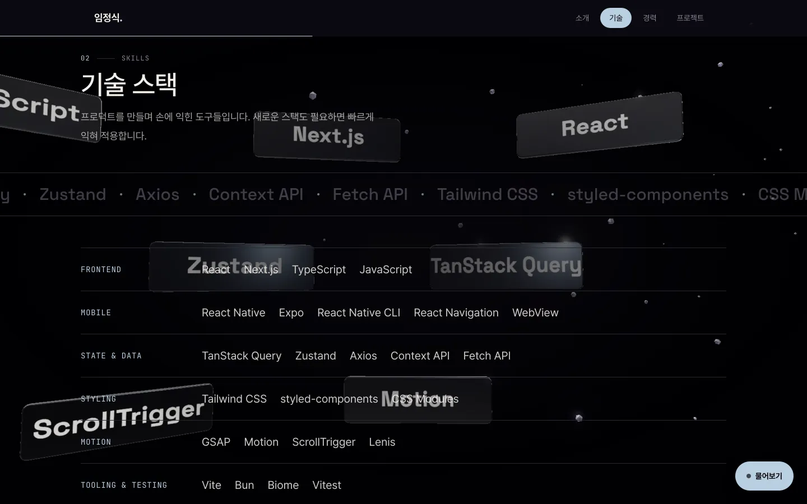
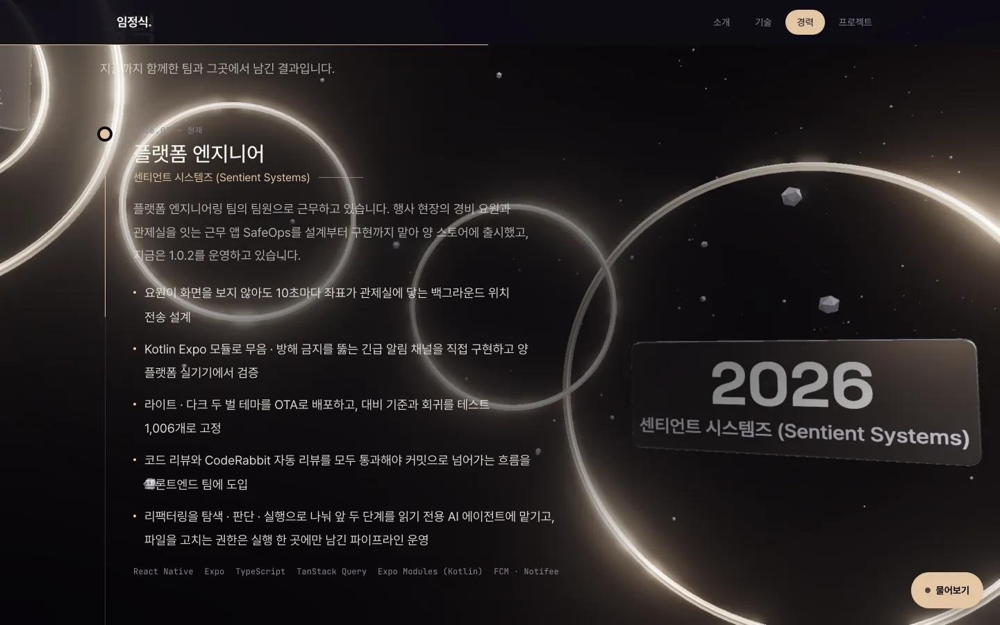
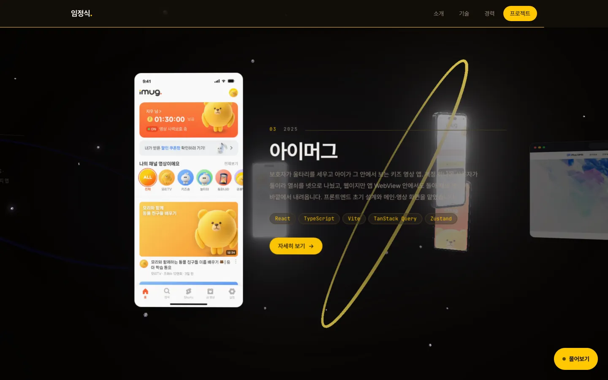
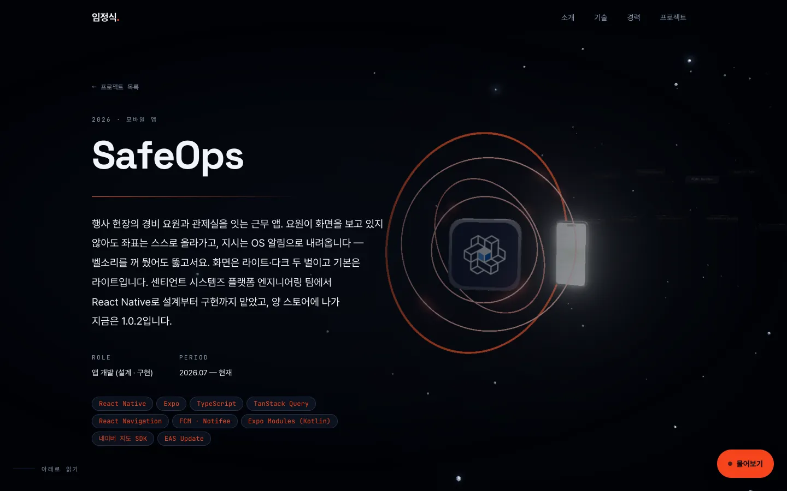
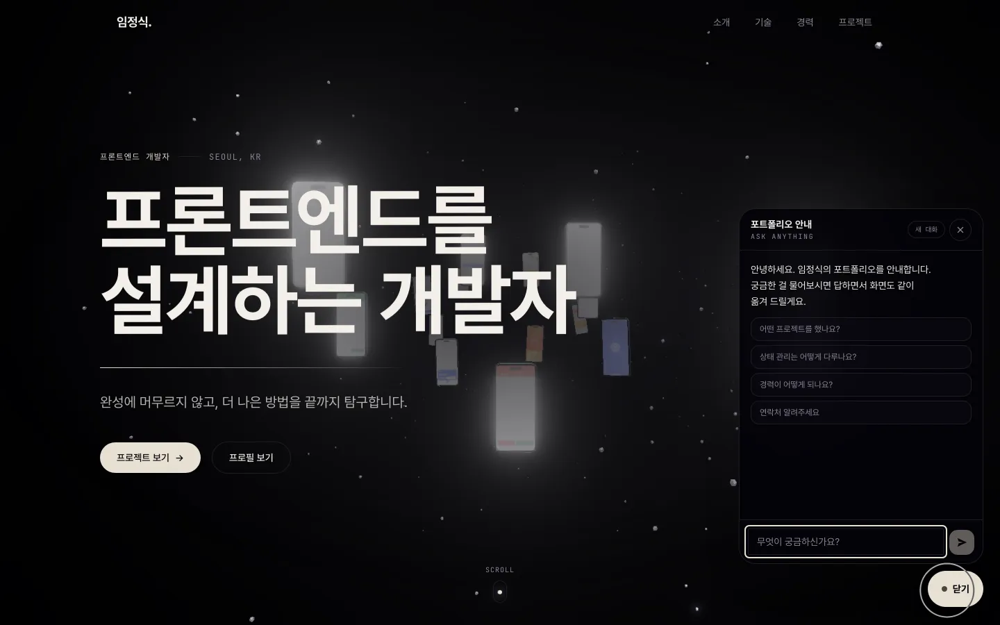

<div align="center">

# 임정식 &nbsp;·&nbsp; Portfolio

**어두운 전시장 하나를 스크롤로 지나가는 포트폴리오 겸 이력서**

섹션이 나타났다 사라지는 대신, 카메라 하나가 한 공간 안의 다섯 장소를 날아서 지나간다.

[**→ 사이트 열기**](https://limjeongsik-portfolio.vercel.app)


</div>



## 스크롤이 유일한 시간축이다

카메라의 자리·시선·화각과 물건의 회전각이 전부 **지금 스크롤 위치의 순수 함수**다. 1px 굴리면
1px만큼 움직이고, 손을 떼면 선다. 시간으로 도는 트윈이 없으니 되감아도 같은 자리가 나온다.

```
스크롤 ──────────────────────────────────────────────────────────────▶

   복도            비석           드럼           계단          갤러리
   hero           about         skills       experience      projects

  폰 목업이       초상을 새긴     기술명 판이     연도 판이      프로젝트마다
  떠 있는 복도를   슬래브 둘레를   안쪽 벽을      나선으로       자리가 있고
  카메라가        반 바퀴 넘게    두른 원통.     감겨 오르고    화면 셋이 그
  관통한다        돈다           앞문으로 들어가  카메라가 한    둘레를 돈다.
                              360° 돌고      바퀴 돌며      카메라는 옆으로
                              뒷문으로 나온다  올라간다       걷는다
```

지나온 장소는 페이드로 지우지 않고 그 자리에 그대로 남는다. 다섯 장소를 지나는 동안 지면색도
함께 갈린다.

<table>
<tr>
<td width="50%">

<br><b>드럼</b> — 기술명 판이 원통 안쪽 벽을 두르고, 카메라가 그 안을 통과한다
</td>
<td width="50%">

<br><b>계단</b> — 연도 판이 나선으로 감겨 오르고, 항목 하나가 화면 가운데 오면 같은 순서의 판을 정면으로 본다
</td>
</tr>
<tr>
<td width="50%">

<br><b>갤러리</b> — 세로 스크롤이 가로 이동을 몰고, 지면색은 가운데 카드를 따른다
</td>
<td width="50%">

<br><b>상세</b> — 같은 무대의 한참 안쪽. 목록에서 누르는 건 보던 고리를 통과해 들어가는 일이다
</td>
</tr>
</table>

프로젝트 상세(`/projects/:slug`)도 **같은 무대 위에 있다.** 무대는 라우터 바깥에 살아서 페이지가
갈려도 파괴되지 않고, 그래서 페이지 이동은 화면을 갈아 끼우는 일이 아니라 카메라가 그리로 날아가는
일이 된다.

## AI 안내자



우측 하단 버튼을 누르면 채팅이 열린다. 방문자가 물으면 답하면서 **화면까지 같이 옮긴다** —
"경력이 어떻게 되나요"에 글로 답하고 경력 구간으로 스크롤하는 식이다.

모델이 부르는 도구는 일곱 개가 브라우저에서 돌고(스크롤, 프로젝트 열기, 카드 그리기), 상세
사례를 꺼내는 도구 하나가 서버에서 돈다. 전체 콘텐츠를 매 요청에 싣는 건 낭비라 프로필·경력·
활동·기술·프로젝트 요약만 시스템 프롬프트에 싣고, 깊은 질문이 왔을 때만 서버 도구로 상세를
꺼낸다.

키는 **서버에서만 읽는다.** `VITE_` 접두사를 붙이면 클라이언트 번들에 그대로 박히므로 절대
붙이지 않는다.

```bash
# .env.local
GOOGLE_GENERATIVE_AI_API_KEY=
GEMINI_MODEL=          # 생략하면 Lite 계열 기본값
```

무료 티어 한도가 계열마다 다르다. Flash는 모델당 하루 20건이라 공개 사이트에서는 금방 마르고,
Lite는 훨씬 넉넉하다. 한도가 차면 `GEMINI_MODEL`만 갈아 끼우면 된다. 쓸 수 있는 모델 목록은
[`docs/PROGRESS.md`](docs/PROGRESS.md)에 표로 있다.

<br clear="right">

## 시작하기

패키지 매니저는 Bun, 린트와 포맷은 Biome를 쓴다. ESLint와 Prettier는 없다.

```bash
bun install
bun run dev
```

`bun run dev` 하나로 AI 안내자의 API까지 같이 뜬다. 별도 서버를 띄울 필요가 없다.

| 명령 | 하는 일 |
|------|---------|
| `bun run dev` | 개발 서버. Vite 플러그인이 `/api/chat`도 함께 띄운다 |
| `bun run build` | `tsc -b` 후 프로덕션 빌드. 타입 에러가 있으면 빌드가 깨진다 |
| `bun run preview` | 빌드 결과를 로컬에서 서빙. **성능은 여기서 잰다** |
| `bun run knowledge` | `src/data/*.ts`를 읽어 AI 안내자가 쓰는 지식 파일을 다시 만든다 |
| `bun run check` | Biome 린트 + 포맷 검사 |
| `bun run check:fix` | 린트 + 포맷 자동 수정 |

테스트 러너는 아직 없다.

## 콘텐츠만 고치기

화면에 나오는 글과 목록은 전부 `src/data/*.ts`에 있다. 컴포넌트에 하드코딩된 문구는 없으므로,
내용을 바꾸는 일은 로직을 건드리지 않는다.

| 파일 | 내용 |
|------|------|
| `profile.ts` | 이름, 연락처, 소개, 프로필 사진 |
| `experience.ts` | 경력 |
| `activities.ts` | 컨퍼런스·세미나처럼 경력에도 프로젝트에도 안 들어가는 것 |
| `skills.ts` | 기술 스택 |
| `projects.ts` | 프로젝트 목록과 상세 전부 |
| `socials.ts` | 소셜 링크 |
| `nav.ts` | 내비게이션 항목 |

타입은 `src/types/content.ts` 한 곳에 있다.

**고친 뒤에 두 가지를 잊지 말 것.**

```bash
bun run knowledge   # AI 안내자가 읽는 지식 재생성
bun run check:fix   # 생성 파일이 JSON 형식으로 나오므로 포맷을 한 번 먹인다
```

`bun run knowledge`를 빼먹으면 화면의 내용과 AI 안내자의 답이 갈린다. 그리고 루트의
`resume/`는 `src/data`를 **손으로 복사한 것**이라 자동으로 따라오지 않는다.

이미지와 폰트는 원본을 그대로 번들하지 않고 스크립트로 줄여서 쓴다.

```bash
python3 scripts/optimize-images.py   # 원본 이미지 → 표시 크기 webp (Pillow 필요)
python3 scripts/subset-fonts.py      # Pretendard OTF → 서브셋 woff2 (fonttools[woff], brotli 필요)
```

## 구조

```
src/
  routes/         Home · ProjectDetail
  components/
    sections/     홈의 다섯 구간
    home/stage/   홈 무대의 다섯 장소
    stage/        무대 장치 — 렌더러·빛·재질·스크롤 축 (홈과 상세가 나눠 쓴다)
    project/      상세 페이지의 구간들
    assistant/    AI 안내자
    ui/           작은 조각들
  data/           콘텐츠 (편집 지점)
  lib/            gsap · lenis · scroll · typography · atmosphere · transition …
  styles/         Tailwind v4 @theme 토큰
api/
  chat.ts         Vercel 서버리스 진입점
  _lib/           핸들러 · 프롬프트 · 생성된 지식
resume/           사이트와 별개인 A4 이력서 (빌드 대상 아님)
docs/PROGRESS.md  현재 상태 · 결정사항 · 함정 노트
```

스택에서 한 번씩 밟았던 것들:

| | |
|---|---|
| **React 19 + Vite 8** | 라우팅은 react-router-dom 7 |
| **Tailwind CSS v4** | `tailwind.config.js`가 없다. 색과 폰트 토큰은 `src/styles/index.css`의 `@theme` 블록에서 정한다 |
| **three.js** | 무대는 사이트에 하나뿐이고 라우터 바깥에 산다. 라우트가 갈려도 파괴되지 않는다 |
| **GSAP + motion** | 스크롤에 매달린 연출은 GSAP, 뷰포트 리빌은 motion. 새 모션은 `prefers-reduced-motion`을 반드시 존중한다 |
| **Lenis** | 관성 스크롤이 window 스크롤을 소유한다. 프로그래매틱 이동에 `window.scrollTo()`를 쓰면 안 되고 `@/lib/lenis`를 거쳐야 한다 |
| **AI SDK + Gemini** | 서버는 `src/data`를 직접 import할 수 없어서 `bun run knowledge`가 다리를 놓는다 |

경로 별칭은 `@/*` → `src/*`다.

## 배포

Vercel에 올라가 있고, GitHub `main`에 push하면 자동으로 배포된다. `vercel.json`이 빌드 커맨드와
출력 디렉터리, SPA rewrite(`/api/*` 제외), 함수 `maxDuration`을 들고 있어서 대시보드에서 따로
만질 것은 없다.

배포별 URL(`portfolio-<해시>-...`)은 Deployment Protection이 걸려 401이 난다. 공개로 열리는 건
프로덕션 별칭뿐이니 링크를 공유할 때 배포 URL을 주지 않는다.

## 더 읽을 것

- [`docs/PROGRESS.md`](docs/PROGRESS.md) — 현재 상태, 구조, 결정사항, 그리고 **함정 노트**.
  한 번씩 밟았던 것들이 재발 방지용으로 정리돼 있다. 무대나 스크롤을 건드리기 전에 먼저 읽는다
- [`CLAUDE.md`](CLAUDE.md) — 명령어, 코딩 규약, 보안 주의사항
- [`resume/README.md`](resume/README.md) — A4 이력서를 고치는 법
