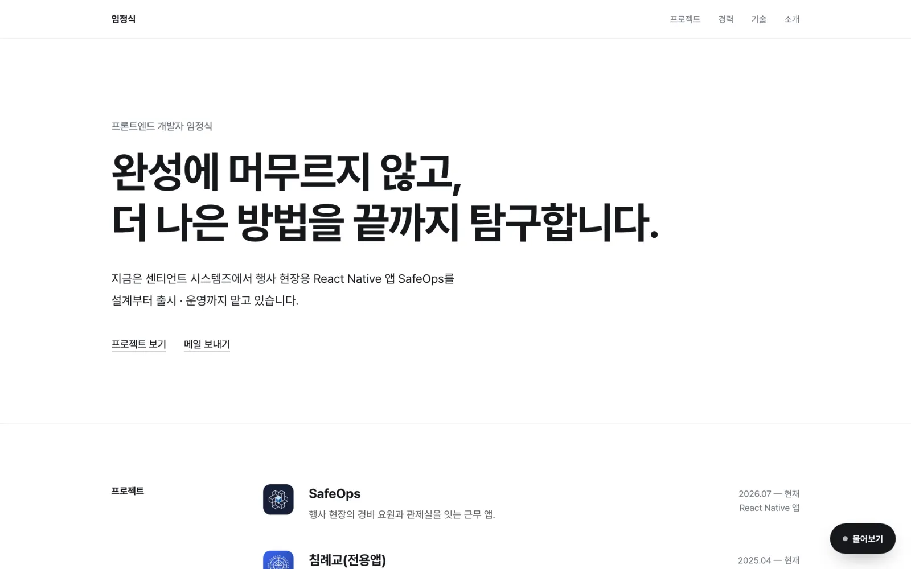
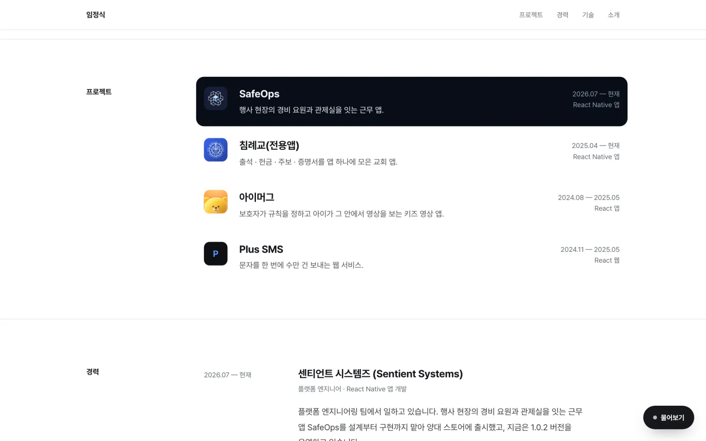
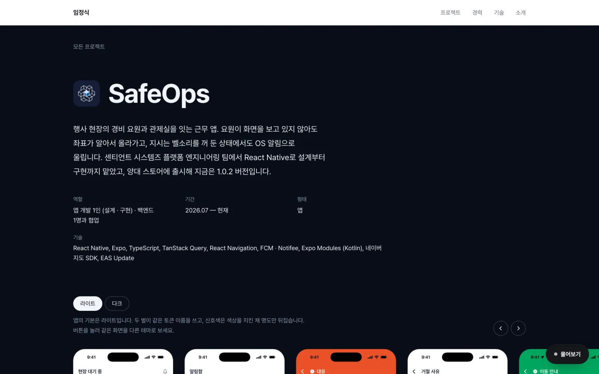
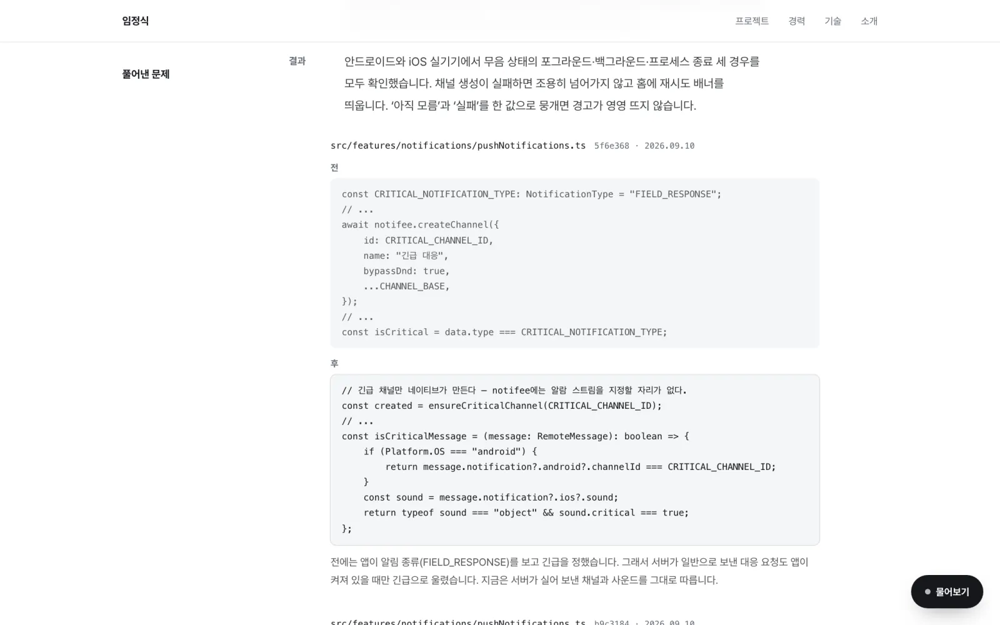
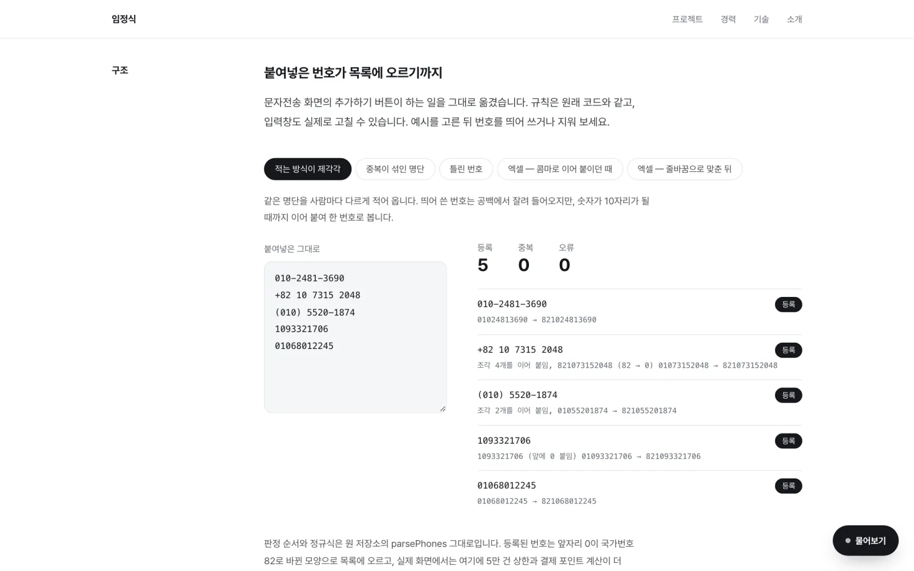
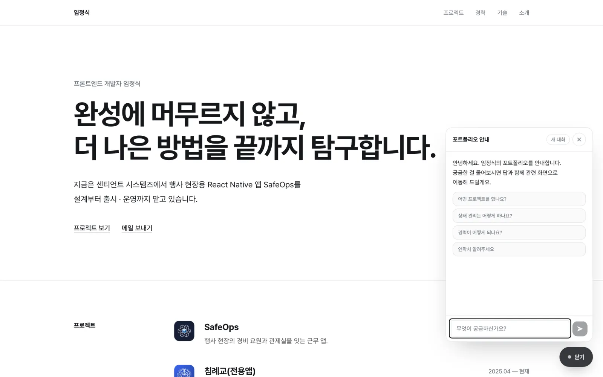

<div align="center">

# 임정식 &nbsp;·&nbsp; Portfolio

**프론트엔드 개발자의 포트폴리오 겸 이력서 — 무엇을 풀었는지, 그 근거가 어떤 코드였는지를 읽히게 만든 사이트**

[**→ 사이트 열기**](https://limjeongsik-portfolio.vercel.app)


</div>



## 읽히는 게 먼저다

처음에는 three.js 3D 공간을 카메라가 날아다니는 사이트였다. 보기엔 화려했지만 정작 글이 안 읽혔다.
그래서 표현 계층을 통째로 다시 썼다. 3D 무대 · 관성 스크롤 · 커스텀 커서 · 스크롤 연출을 전부 걷어내고,
모션 라이브러리 없이 CSS만 남겼다.

- **사이트는 무채색, 색은 프로젝트에만.** 흰 지면 · 잉크 · 선 하나로 짜고, 프로젝트의 색은 목록 줄에
  마우스를 올렸을 때와 상세의 표지에서만 나온다.
- **서체는 Pretendard 하나.** 위계는 크기와 굵기로만 가른다. 실제로 쓰는 한글만 구운 서브셋이라 첫
  로드에 받는 폰트는 세 굵기 합쳐 약 210KB다.
- **저절로 움직이는 건 첫 화면 등장 하나뿐.** 나머지 움직임은 전부 사용자의 행동에 답하는 것이고,
  동작 줄이기 설정에서는 모두 즉시 끝난다.

<table>
<tr>
<td width="50%">

<br><b>프로젝트 목록</b> — 줄에 마우스를 올리면 그 프로젝트의 지면색으로 칠해진다
</td>
<td width="50%">

<br><b>상세 표지</b> — 같은 색으로 시작한 띠 위에 요약 · 역할 · 기술, 그 아래 앱 화면 선반
</td>
</tr>
</table>

## 사례마다 코드 근거를 붙인다

"이렇게 해결했다"만 쓰면 증명이 안 된다. 프로젝트 상세의 사례마다 **원 저장소 git 이력에서 뽑은
전 · 후 코드**를 파일 경로 · 커밋 해시 · 날짜 · 달라진 동작 한 줄과 함께 싣는다. 지어낸 코드나 다듬은
의사 코드는 넣지 않고, 생략은 `// ...`로만 한다. 그 커밋에서 새로 들어간 코드는 전 칸을 지어내지 않고
"추가" 칸 하나만 그린다.

공동 개발한 저장소에서는 **본인 커밋만** 근거로 쓴다. 동료가 구현한 부분은 사례에서 뺐다.

<table>
<tr>
<td width="50%">

<br><b>코드 근거</b> — 같은 자리의 코드가 전에는 어땠고 지금은 어떤가
</td>
<td width="50%">

<br><b>직접 만져 보는 데모</b> — 원 코드의 번호 판정을 옮겨 와, 입력을 고치면 판정이 바로 바뀐다
</td>
</tr>
</table>

내용은 따로 검토받는다. 읽기 전용 리뷰어 둘(채용 담당자 · 사실 검증)이 과장 · 오류와 수정안을 내면,
원 저장소 이력과 대조해 맞는 것만 고친다(`.claude/skills/content-review`).

## AI 안내자



우측 하단 버튼을 누르면 채팅이 열린다. 방문자가 물으면 답하면서 **화면까지 같이 옮긴다** —
"경력이 어떻게 되나요"에 글로 답하고 경력 구간으로 스크롤하는 식이다.

모델이 부르는 도구는 일곱 개가 브라우저에서 돌고(스크롤, 프로젝트 열기, 카드 그리기), 상세
사례를 꺼내는 도구 하나가 서버에서 돈다. 전체 콘텐츠를 매 요청에 싣는 건 낭비라 프로필·경력·
활동·기술·프로젝트 요약만 시스템 프롬프트에 싣고, 깊은 질문이 왔을 때만 서버 도구로 상세를
꺼낸다.

키는 **서버에서만 읽는다.** `VITE_` 접두사를 붙이면 클라이언트 번들에 그대로 박히므로 절대
붙이지 않는다.

```bash
# .env.local
GOOGLE_GENERATIVE_AI_API_KEY=
GEMINI_MODEL=          # 생략하면 Lite 계열 기본값
```

무료 티어 한도가 계열마다 다르다. Flash는 모델당 하루 20건이라 공개 사이트에서는 금방 마르고,
Lite는 훨씬 넉넉하다. 한도가 차면 `GEMINI_MODEL`만 갈아 끼우면 된다. 쓸 수 있는 모델 목록은
[`docs/PROGRESS.md`](docs/PROGRESS.md)에 표로 있다.

<br clear="right">

## 시작하기

패키지 매니저는 Bun, 린트와 포맷은 Biome를 쓴다. ESLint와 Prettier는 없다.

```bash
bun install
bun run dev
```

`bun run dev` 하나로 AI 안내자의 API까지 같이 뜬다. 별도 서버를 띄울 필요가 없다.

| 명령 | 하는 일 |
|------|---------|
| `bun run dev` | 개발 서버. Vite 플러그인이 `/api/chat`도 함께 띄운다 |
| `bun run build` | `tsc -b` 후 프로덕션 빌드. 타입 에러가 있으면 빌드가 깨진다 |
| `bun run preview` | 빌드 결과를 로컬에서 서빙. **성능은 여기서 잰다** |
| `bun run knowledge` | `src/data/*.ts`를 읽어 AI 안내자가 쓰는 지식 파일을 다시 만든다 |
| `bun run check` | Biome 린트 + 포맷 검사 |
| `bun run check:fix` | 린트 + 포맷 자동 수정 |

테스트 러너는 아직 없다.

## 콘텐츠만 고치기

화면에 나오는 글과 목록은 전부 `src/data/*.ts`에 있다. 컴포넌트에 하드코딩된 문구는 없으므로,
내용을 바꾸는 일은 로직을 건드리지 않는다.

| 파일 | 내용 |
|------|------|
| `profile.ts` | 이름, 연락처, 소개, 프로필 사진 |
| `experience.ts` | 경력 |
| `activities.ts` | 컨퍼런스·세미나처럼 경력에도 프로젝트에도 안 들어가는 것 |
| `skills.ts` | 기술 스택 |
| `projects.ts` | 프로젝트 목록과 상세 전부(사례 · 코드 근거 · 설명 그림 데이터) |
| `socials.ts` | 소셜 링크 |
| `nav.ts` | 내비게이션 항목 |

타입은 `src/types/content.ts` 한 곳에 있다.

**고친 뒤에 잊지 말 것.**

```bash
bun run knowledge             # AI 안내자가 읽는 지식 재생성
bun run check:fix             # 생성 파일이 JSON 형식으로 나오므로 포맷을 한 번 먹인다
python3 scripts/subset-fonts.py   # 새 한글이 들어갔으면 폰트 서브셋 재생성 (fonttools[woff], brotli 필요)
```

`bun run knowledge`를 빼먹으면 화면의 내용과 AI 안내자의 답이 갈린다. 폰트 서브셋은 안 돌려도 글자가
튀지는 않지만(안전망 서브셋이 받아진다) 그 페이지가 170KB를 더 받는다. 그리고 루트의 `resume/`는
`src/data`를 **손으로 복사한 것**이라 자동으로 따라오지 않는다.

이미지는 원본을 그대로 번들하지 않고 `python3 scripts/optimize-images.py`로 표시 크기 webp를 만들어 쓴다
(Pillow 필요).

## 구조

```
src/
  routes/            Home(원페이지) · ProjectDetail(slug 조회, 없으면 홈으로)
  components/
    layout/          Header · Footer · ScrollManager(해시 이동 · 뒤로 가기 위치 복원)
    home/            Hero · ProjectIndex · Experience · Skills · About
    project/         ProjectCover · ScreenShelf · CodeChange(전/후 코드) · ProjectRow
      figures/       프로젝트마다의 설명 그림 — Pipeline · Anatomy · Runtime · Bridge · Sieve · Windowing
    assistant/       AI 안내자 — 런처 · 패널 · 대화 · 도구 카드
    ui/              Section(왼쪽 레일 제목 + 오른쪽 기둥) · TextLink
  data/              콘텐츠 (편집 지점)
  lib/               typography(조판 규약) · scroll · assistant(도구 정의 · 다리)
  styles/            Tailwind v4 @theme 토큰 · 생성된 @font-face
api/
  chat.ts            Vercel 서버리스 진입점
  _lib/              핸들러 · 프롬프트 · 생성된 지식
scripts/             build-knowledge · subset-fonts · optimize-images
resume/              사이트와 별개인 A4 이력서 (빌드 대상 아님)
docs/PROGRESS.md     현재 상태 · 결정사항 · 함정 노트
```

스택에서 한 번씩 밟았던 것들:

| | |
|---|---|
| **React 19 + Vite 8** | 라우팅은 react-router-dom 7. 해시 링크는 라우터가 스크롤해 주지 않아 `ScrollManager`가 맡는다 |
| **Tailwind CSS v4** | `tailwind.config.js`가 없다. 색과 폰트 토큰은 `src/styles/index.css`의 `@theme` 블록에서 정한다. 프로젝트 색은 `:root`를 갈지 않고 CSS 변수(`--p-paper` …)로 싣는다 |
| **모션은 CSS만** | 모션 라이브러리를 쓰지 않는다. 새 움직임은 사용자의 행동에 답하는지 먼저 본다. `prefers-reduced-motion`은 전역 미디어쿼리가 일괄로 끈다 |
| **네이티브 스크롤** | 프로그래매틱 이동은 `@/lib/scroll`을 거치고, 부드러운 이동과 헤더 여백은 CSS(`scroll-behavior` · `scroll-padding-top`)가 맡는다 |
| **Pretendard 서브셋** | 소스에 쓰는 한글만 구운 `core`와 KS X 1001 전체 `subset` 두 벌. `@font-face`는 스크립트가 써 낸다 — 손으로 적지 않는다 |
| **AI SDK + Gemini** | 서버는 `src/data`를 직접 import할 수 없어서 `bun run knowledge`가 다리를 놓는다 |

경로 별칭은 `@/*` → `src/*`다.

## 배포

Vercel에 올라가 있고, GitHub `main`에 push하면 자동으로 배포된다. `vercel.json`이 빌드 커맨드와
출력 디렉터리, SPA rewrite(`/api/*` 제외), 함수 `maxDuration`을 들고 있어서 대시보드에서 따로
만질 것은 없다.

배포별 URL(`portfolio-<해시>-...`)은 Deployment Protection이 걸려 401이 난다. 공개로 열리는 건
프로덕션 별칭뿐이니 링크를 공유할 때 배포 URL을 주지 않는다.

## 더 읽을 것

- [`docs/PROGRESS.md`](docs/PROGRESS.md) — 현재 상태, 구조, 결정사항, 그리고 **함정 노트**.
  한 번씩 밟았던 것들이 재발 방지용으로 정리돼 있다. 손대기 전에 먼저 읽는다
- [`CLAUDE.md`](CLAUDE.md) — 명령어, 코딩 규약, 보안 주의사항
- [`resume/README.md`](resume/README.md) — A4 이력서를 고치는 법
